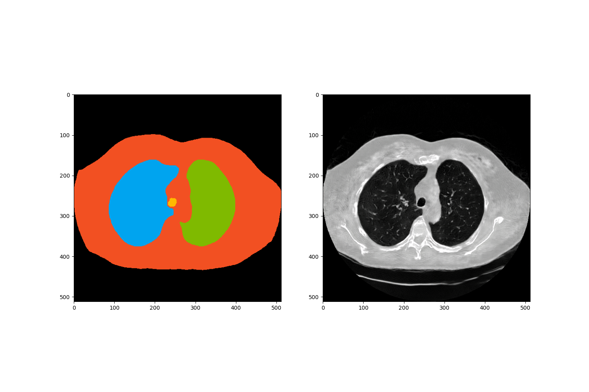
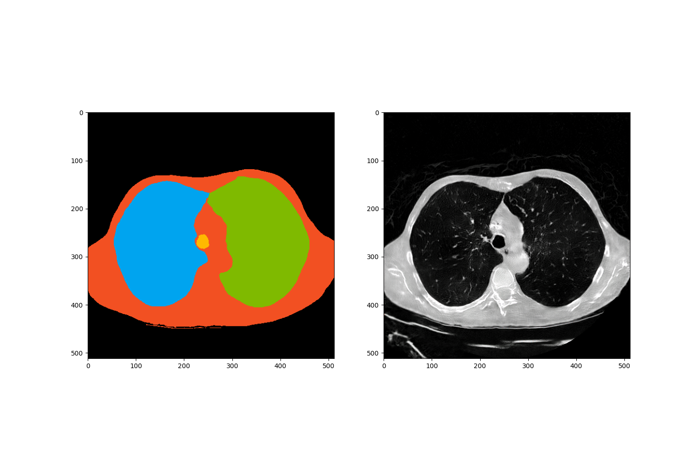

# NoduleGAN

Code Repository based on [RetinaGAN](https://github.com/farrell236/RetinaGAN) for controlled synthesis of Lung Nodules.

## About 
Two-stage process: 
- StyleGAN to generate synthetic masks (healthy only)
- GauGAN to convert mask to CT images

## Examples

&nbsp;&nbsp;

&nbsp;&nbsp;

&nbsp;&nbsp;

